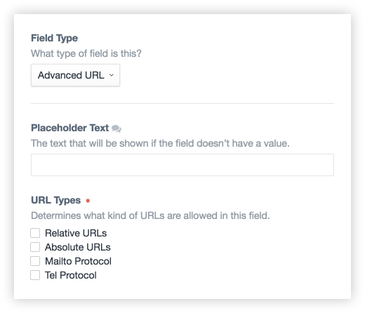

# Advanced URL Field for Craft 3

This plugin provides a field type that can be configured to only allow URLs that match a specific set of formats. It expands upon the built-in URL field by allowing a field to be set to absolute, relative, mailto, or tel uris.

## Requirements

* Craft CMS 3.0.0-RC1 or above

## Installation

_TODO_

## Usage

### Creating an Advanced URL Field

1. Create a new field in your craft control panel via the Settings -> Fields panel.
2. Select *Advanced URL* as the field type.
3. Fill out placeholder text to show when the field is blank.
4. Select which URL types to allow (more info on the types below).
5. Attach the new field to a section.



#### URL Types

* **Relative URLS** must match the format of a URL path, relative to the document root, for example `/about` or `/categories/new#first`.
* **Absolute URLS** must match a full absolute url, prefixed with protocol and containing a domain name, for example `https://www.example.com/` or `https://example.com/about`.
* **Mailto Protocol** must be an email address prefixed by `mailto:`.
* **Tel Protocol** must be a phone number prefixed by `tel:`.

### Templating with an Advanced URL Field

In a Twig template, the field is rendered directly, without any other additional inner properties. See the following example, where `myURL` is an Advanced URL field on the entry:

```twig
<a href="{{ entry.myURL }}">My Link</a>
```

---

*Built for [Craft CMS](https://craftcms.com/) by [Charlie Development](http://charliedev.com/)*
